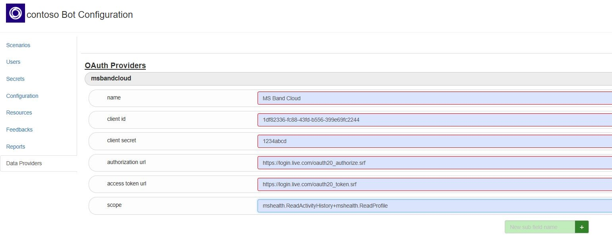

## OAuth Providers - Counting Steps Scenario

This scenario reads the steps count of a user from an authenticated data provider, in this case [Microsoft Band Cloud API](https://developer.microsoftband.com/cloudAPI), and sends the step count as a formatted message to the user.

### Usage
In order to retrieve data from an authenticated data provider and consume it in a scenario, follow the steps below.

#### 1. Configure your application on the data provider's side
In this example, we consume data from Microsoft Band Cloud API. On [Microsoft's application management page](https://account.live.com/developers/applications) we configure our application as follows:

#### 2. Add your application configuartion to the Data Providers tab on Health Bot dashboard
Using the OAuth parameters provided by the data provider, we create a new entry on the "Data Providers" tab:

#### 3. Use the configured Data Provider in the Scenario Composer
Insert a new API Call () to your scenario, choose the data provider defined on the previous step from the dropdown menu, and define the API call just like any other API call (authenticated or not). Our service will take care of token acquisition and refresh for each user using this scenario.

